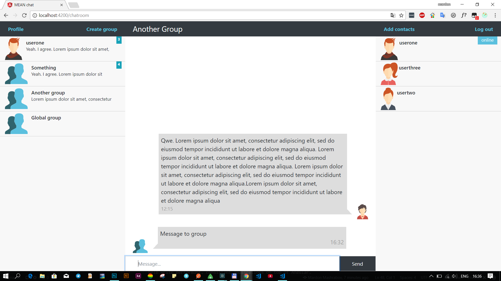
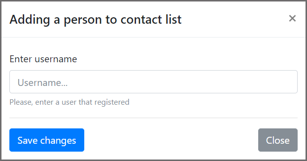
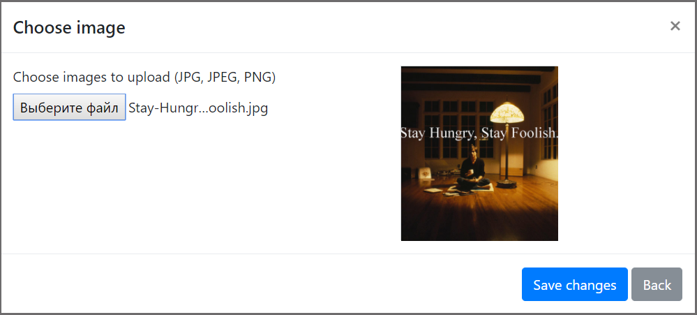

# MEAN chat

> A small chat application built using the **MEAN** stack

# Motivation

This is a personal project with the purpose of better understanding the client-server communication paradigm, new web technologies, especially Angular :)

# Features

* Register and authenticate users using JSON web tokens.

* When a user is logged in, everyone who has the user in contacts are notified.   

* Number of unread messages from specific user/group.  

* Add new user to contact thread   

* Dashboard. ( I know not so much information )  

* In dashboard you can change your profile avatar.  
Choose an image from your computer   
  
or choose default images.   
  
Once you have chosen new avatar it will be replaced everywhere instantly.

* Groups and private chats.

* Choose user to send message just clicking on the user in contact thread or message thread.   

* Notifies a reciever when message is sent. (notifies group members when message is sent to group)  

* Create new group.  

* Add users to group from contacts or by username.

# Technologies

* [NodeJS](https://nodejs.org/) - JavaScript backend/server-side solution of choice

* [Express](https://expressjs.com/) - Node framework that makes handling http requests with ease

  * [JsonWebToken](https://www.npmjs.com/package/jsonwebtoken) - package that helps with generating JWTs for secure authentication

* [MongoDB](https://www.mongodb.com/) - data storage solution that just speaks JSON and pairs very well with Node

  * [Mongoose](http://mongoosejs.com/) - package that helps with object modeling and manages connection between server and database

  * [bcrypt-nodejs](https://www.npmjs.com/package/bcrypt-nodejs) - for salting and hashing the user password to be stored in the database

* [Socket.io](https://socket.io/) - web sockets implementation, fast and reliable real-time communication engine

* [Angular 4](https://angular.io/) - rich frontend web framework, helps creating fast, reliable web applications

  * [Angular-CLI](https://cli.angular.io/) - command line interface for streamlined angular development

  * [TypeScript](https://www.typescriptlang.org/) - superset of JavaScript that can be compiler-checked, also has types!!

  * [Bootstrap](http://getbootstrap.com/) - CSS/JS framework, makes it easy to develop responsive, well polished web apps

* [NgRx](https://github.com/ngrx/platform) - Reactive libraries for Angular.

  * [ngrx/store](https://github.com/ngrx/platform/blob/v4.1.1/docs/store/README.md) - A controlled state container designed to help write performant, consistent applications on top of Angular.
  
  * [ngrx/effects](https://github.com/ngrx/platform/blob/v4.1.1/docs/store/README.md) - Side Effect model for @ngrx/store to model event sources as actions.
  
  * [ngrx/store-devtools](https://github.com/ngrx/platform/blob/v4.1.1/docs/store-devtools/README.md) - Store instrumentation that enables a powerful time-travelling debugger.
  